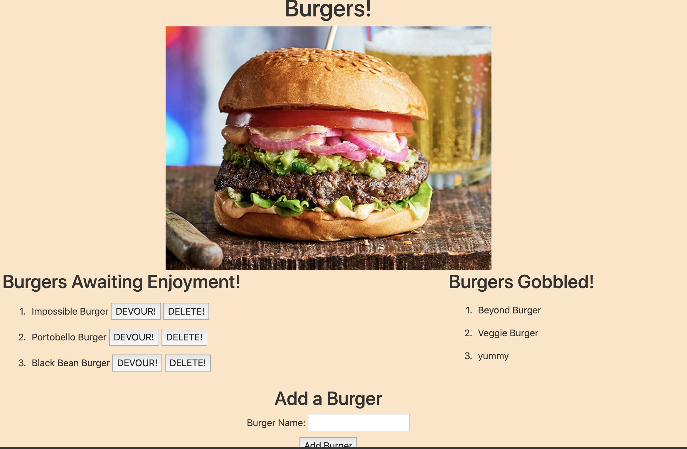

# burger

This app allows the user to enter in a burger of their choice. Then allows the user to delete or devour the burger. Once the burger is devoured it moves the burger to Gobbled column. If the burger is deleted it removes the burger from the list.

Technologies Used: Nodejs, mySQL, Express, Express Handlebars, ORM, Javascript, CSS, Bootstrap